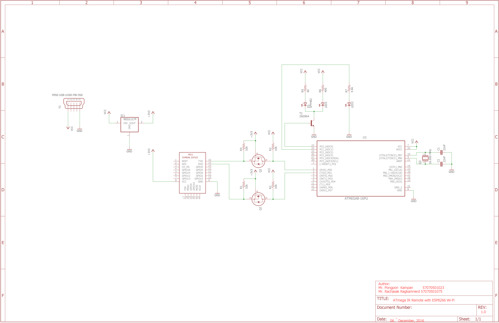

# IRremote-ATMega8

This project is for creating a device to control electronic device with infrared controlled by Smartphone or anything which can connected by Wi-Fi via ESP8266 (However, we connected it via Serial due to subject restriction policy).

This project is created by:

- [Mr. Pongpon Kampan](https://github.com/owlaaz)
- [Mr. Rachasak Ragkamnerd](https://github.com/itpcc)

This project is a project of CPE363 Embedded device from [CPE KMUTT](https:://cpe.kmutt.ac.th).

## Schematic

[Eagle file](Schematic/schematic.sch)

## Read more

- [Custom protocol (applied from NMEA protocol) used in this project (in Thai)](ir_protocol.md)
- [Example Android application used for project demo](https://github.com/owlaaz/IRRemote-Mobile-To-ESP8266)

## Applied repository
- [Arduino IR Remote](https://github.com/z3t0/Arduino-IRremote)
- [Daikin IR Remote](https://github.com/mharizanov/Daikin-AC-remote-control-over-the-Internet)

## Resource 

- [IR Database](http://irdb.tk/api)
- [Using AVR UART](http://www.appelsiini.net/2011/simple-usart-with-avr-libc)
- [Logic level converter](https://learn.sparkfun.com/tutorials/bi-directional-logic-level-converter-hookup-guide)
- [Schematic for LIRC](http://alexba.in/blog/2013/03/09/raspberrypi-ir-schematic-for-lirc/)
- [AVR fus bit calculator](https://elektronik-kompendium.de/public/arnerossius/programme/web/avrfuse/m8fuse.html)
- [USBasp](http://eecs.oregonstate.edu/education/docs/ece375/USBASP-UG.pdf#page=8)
